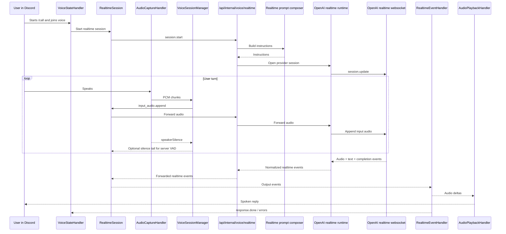

# Realtime Voice System

## Summary

The realtime voice system is the part of Footnote that lets the Discord bot have a live spoken conversation in a voice channel.

At a high level, the Discord bot handles the Discord-specific work: joining the channel, listening for speech, and playing audio back into the room. The backend handles the AI-specific work: building instructions, opening the provider session, translating provider events, and recording usage.

That split is the main point of the design. The bot does not talk to the OpenAI realtime API directly. It opens a trusted websocket to Footnote's backend at `/api/internal/voice/realtime`, and the backend owns the provider connection from there.

## High-Level Flow

## Settings

These are the main settings that change realtime voice behavior.

| Setting                           | Default             | Allowed Values                                                                               | Purpose                                                                                                                              |
| --------------------------------- | ------------------- | -------------------------------------------------------------------------------------------- | ------------------------------------------------------------------------------------------------------------------------------------ |
| `REALTIME_DEFAULT_MODEL`          | `gpt-realtime-mini` | Enum (valid realtime model IDs from the shared provider catalog)                             | Default provider model for realtime voice sessions.                                                                                  |
| `REALTIME_DEFAULT_VOICE`          | `echo`              | Enum (`alloy`, `ash`, `ballad`, `coral`, `echo`, `fable`, `nova`, `onyx`, `sage`, `shimmer`) | Default output voice when a call does not override it.                                                                               |
| `REALTIME_GREETING`               | `Hey, {bot} here.`  | String (non-empty, supports `{bot}`)                                                         | Greeting text sent when the session starts.                                                                                          |
| `REALTIME_TURN_DETECTION`         | `server_vad`        | Enum (`server_vad`, `semantic_vad`)                                                          | Selects provider-side turn handling strategy.                                                                                        |
| `REALTIME_VAD_THRESHOLD`          | provider default    | Number (`0`-`1`)                                                                             | Optional server VAD sensitivity threshold.                                                                                           |
| `REALTIME_VAD_SILENCE_MS`         | provider default    | Integer (`>= 0`)                                                                             | Optional provider silence window used to close a turn. Also used by Discord-side silence-tail injection when `server_vad` is active. |
| `REALTIME_VAD_PREFIX_MS`          | provider default    | Integer (`>= 0`)                                                                             | Optional provider prefix padding so the provider keeps some audio before speech start.                                               |
| `REALTIME_VAD_CREATE_RESPONSE`    | provider default    | Boolean (`true` or `false`)                                                                  | When true, provider auto-creates a response after a detected turn.                                                                   |
| `REALTIME_VAD_INTERRUPT_RESPONSE` | provider default    | Boolean (`true` or `false`)                                                                  | When true, new user speech can interrupt an in-flight response.                                                                      |
| `REALTIME_VAD_EAGERNESS`          | provider default    | Enum (`low`, `medium`, `high`, `auto`)                                                       | Optional semantic VAD eagerness for `semantic_vad`.                                                                                  |
| `/call voice`                     | per-call override   | Enum (same values as `REALTIME_DEFAULT_VOICE`)                                               | Overrides the default voice for one call session.                                                                                    |

## System Breakdown

## 1. Discord Entry and Session Start

The Discord entrypoint is the `/call` slash command in [call.ts](../../packages/discord-bot/src/commands/call.ts). That command joins the target voice channel, records the initiating user, and optionally records a per-call voice override.

The actual realtime session does not start just because the bot joined the channel. The bot waits for the initiating user to join and start the conversation. That orchestration lives in [VoiceStateHandler.ts](../../packages/discord-bot/src/events/VoiceStateHandler.ts).

When conversation start is triggered, `VoiceStateHandler`:

- builds participant context
- creates the Discord-side realtime session wrapper
- attaches audio playback listeners
- initializes Discord audio capture
- sends the configured greeting

This keeps the session lifecycle tied to real human participation instead of opening a provider session while the bot is sitting alone in a voice channel.

## 2. Discord-Side Realtime Session

The Discord-side session wrapper lives in [realtimeService.ts](../../packages/discord-bot/src/utils/realtimeService.ts). Its job is to hide the backend websocket protocol from the rest of the Discord bot.

This layer:

- connects to the trusted backend websocket
- sends `session.start` with voice options and participant context
- streams PCM audio as `input_audio.append`
- sends greeting and other text turns
- normalizes backend events into local audio/text/completion events

This is intentionally not the provider boundary. It is only the Discord-to-backend transport layer.

## 3. Audio Capture and Turn Closing

Discord audio capture lives in [AudioCaptureHandler.ts](../../packages/discord-bot/src/voice/AudioCaptureHandler.ts). It subscribes to Discord voice receiver streams, decodes Opus to PCM, resamples the audio, and emits `audioChunk` events to the session manager.

Discord voice activity mode can stop sending audio immediately when the user stops speaking. That means the provider may not observe enough trailing silence to close a turn on its own.

To compensate, [VoiceSessionManager.ts](../../packages/discord-bot/src/voice/VoiceSessionManager.ts) listens for `speakerSilence` events and appends a short silence tail when `server_vad` is active. The silence length is derived from `REALTIME_VAD_SILENCE_MS`, clamped to a safe range. That design lets provider-side VAD stay authoritative while adapting to Discord's voice-activity behavior.

The invariant is simple: Discord streams audio continuously while the user is speaking, but the provider still decides when the turn is complete.

## 4. Backend Trusted Boundary

The backend websocket handler lives in [internalVoiceRealtime.ts](../../packages/backend/src/handlers/internalVoiceRealtime.ts). This is Footnote's trusted internal boundary for Discord realtime sessions.

Its responsibilities are:

- authenticate the trusted websocket upgrade
- validate client events against `@footnote/contracts/voice`
- create and own one backend realtime session
- forward normalized events back to Discord
- record backend-owned usage and cost data on `response.done`

This is the main architectural seam. If the Discord bot needs realtime voice, it goes through this handler instead of opening a provider websocket directly.

## 5. Prompt Composition

Realtime prompt composition lives in [realtimePromptComposer.ts](../../packages/backend/src/services/prompts/realtimePromptComposer.ts). The backend builds one instruction string for the provider session using:

- the shared conversational system layer
- the realtime voice surface layer
- one active persona layer (profile overlay when present, otherwise shared Footnote persona plus the realtime persona supplement)
- the current participant roster
- optional recent transcript summary

Realtime reuses the shared prompt-layer renderer and profile-overlay formatter, but it does not use normal chat's full request context, Context Steps, or model-input assembly. Its active profile is the backend's configured bot profile for the session.

## 6. Provider Runtime Adapter

The provider adapter lives in [openAiRealtimeVoiceRuntime.ts](../../packages/agent-runtime/src/openAiRealtimeVoiceRuntime.ts). This adapter is responsible for:

- opening the OpenAI realtime websocket
- sending the initial `session.update`
- applying the configured voice and turn-detection settings
- waiting for the provider session to become ready
- translating provider events into Footnote-owned normalized events

This is the only place that should know the provider websocket details for realtime voice. Discord and the backend boundary work in Footnote-owned contracts, not provider-native payloads.

## 7. Event Return Path and Playback

Provider events are normalized by the runtime, forwarded through the backend websocket handler, and consumed by Discord's realtime event layer in [RealtimeEventHandler.ts](../../packages/discord-bot/src/realtime/RealtimeEventHandler.ts).

That event layer emits streamed audio chunks immediately so playback can begin before the full response completes. Playback is then handled by [AudioPlaybackHandler.ts](../../packages/discord-bot/src/voice/AudioPlaybackHandler.ts), which keeps a guild-local playback pipeline alive long enough to avoid clipping between chunks or turns.

The result is a streamed path in both directions:

- user audio goes Discord -> backend -> provider
- model audio goes provider -> backend -> Discord playback

## 8. Observability and Logging

Realtime voice uses structured logging across Discord, backend, and runtime layers. The logging favors:

- session lifecycle logs
- speaking start/end signals
- response completion logs
- warnings and errors

It avoids noisy per-chunk logs and keeps the default debug output focused on lifecycle and failure signals.

The backend remains the authoritative owner of realtime usage and cost recording. Discord may display or log completion metadata, but provider cost accounting is backend-owned.

## 9. Design Constraints

The current system is built around a few explicit constraints:

- Discord owns Discord UX, not provider session semantics.
- Backend owns the trusted voice control-plane boundary.
- Provider-specific websocket logic stays inside the runtime adapter.
- Server VAD remains authoritative for turn completion in the normal path.
- Discord voice-activity behavior is accommodated with silence-tail injection instead of moving turn closure back into Discord logic.

That gives realtime voice the same ownership story as the rest of the migration work: product-facing code uses Footnote-owned boundaries, and provider-specific behavior sits behind those boundaries.

## Alignment with normal chat

Realtime is a separate streaming session, not another route through `POST /api/chat`. The matrix below describes current behavior; it is not a plan to force voice through the ordinary chat workflow.

| Area                                | Current behavior and evidence                                                                                                                                                                                                                                                                                                                                                                                                                            | Status / dependency                                                                                                                                                                                                                     |
| ----------------------------------- | -------------------------------------------------------------------------------------------------------------------------------------------------------------------------------------------------------------------------------------------------------------------------------------------------------------------------------------------------------------------------------------------------------------------------------------------------------- | --------------------------------------------------------------------------------------------------------------------------------------------------------------------------------------------------------------------------------------- |
| Profile and speech                  | Chat resolves request/profile context and can apply profile overlays (`chatOrchestrator/profileResolution.ts`). Realtime uses backend `runtimeConfig.profile` at session setup; it does not use chat request profile resolution. `/call voice` can override the configured voice, but the voice contract has no `expressionStrength` or shared effective-speech settings (`realtimePromptComposer.ts`, `VoiceSubsystem.ts`, `contracts/voice/types.ts`). | Partial profile reuse; speech resolution depends on [#534](https://github.com/footnote-ai/footnote/issues/534), including final human audition of voice choices.                                                                        |
| Conversation and context            | Chat builds a `ConversationContextEnvelope`, runs Context Steps, and assembles model input (`chatOrchestrator/requestNormalization.ts`, `workflowEngine/contextStepHelpers.ts`). Realtime carries participant metadata and optional transcript summaries only (`contracts/voice/types.ts`).                                                                                                                                                              | Separate streaming context today. Cross-surface continuity is #559; source retrieval is absent and would need deliberate design with #539.                                                                                              |
| Execution identity and provenance   | Chat records correlation and Run → Step → Attempt → Result evidence for Trace. Realtime forwards a provider `responseId` and optional usage to Discord, but creates no canonical Run or response Trace record (`internalVoiceRealtime.ts`, `contracts/voice/types.ts`).                                                                                                                                                                                  | Inspectability gap; provider response IDs are not Footnote execution lineage.                                                                                                                                                           |
| Usage and cost                      | Chat keeps available usage, cache/reasoning details, and cost estimates with workflow Attempts. Realtime normalizes aggregate prompt/completion tokens and model, then estimates per-response cost; missing token fields become zero (`openAiRealtimeVoiceRuntime.ts`, `internalVoiceRealtime.ts`). The voice usage contract has no cached-input or reasoning-token fields.                                                                              | Backend remains the cost authority, but availability/completeness differs (`reviewedChatWorkflow.ts`, `llmCostRecorder.ts`).                                                                                                            |
| Review and safety                   | Chat runs through the backend workflow, including planning, review, and deterministic policy checks. Realtime opens a provider session directly; it does not run the chat planner/reviewer or workflow review/breaker path, and creates no workflow review evidence (`chatService.ts`, `reviewedChatWorkflow.ts`, `internalVoiceRealtime.ts`).                                                                                                           | Separate execution path, not equivalent policy coverage. Any future authority requirements should follow [#709](https://github.com/footnote-ai/footnote/issues/709); this audit does not claim those policies are enforced in Realtime. |
| Provider boundary and streaming     | Text generation uses the generation runtime. Realtime uses a separate `RealtimeVoiceRuntime`; the backend currently constructs the OpenAI Realtime adapter. Audio streaming, speaker labels, and VAD/turn detection are voice-specific (`agent-runtime/openAiRealtimeVoiceRuntime.ts`, `contracts/voice`).                                                                                                                                               | Deliberately different contracts; provider websocket details stay in the runtime adapter.                                                                                                                                               |
| Prompt caching                      | Chat attempts can retain provider cache-use details when the provider returns them; #552 tracks pending coverage and cost-completeness measurement, including held provider-backed work. Realtime usage has no cache read/write fields and its handler records none (`openAiRealtimeVoiceRuntime.ts`, `internalVoiceRealtime.ts`, `contracts/voice`).                                                                                                    | Realtime cache behavior is unmeasured. Do not infer provider caching or cache savings from the current usage record; #552 owns the broader cache measurement.                                                                           |
| Session observability and privacy   | Chat facts are available through backend-owned Run/Trace projections. Realtime emits lifecycle/provider metadata but has no durable session record. Discord also debug-logs full generated text (`discord-bot/src/events/VoiceSubsystem.ts`).                                                                                                                                                                                                            | Thinner session evidence; full response text in debug logs is a privacy follow-up. Not all Realtime logs are metadata-only.                                                                                                             |
| Availability and fail-open behavior | Ordinary chat does not depend on voice. The Discord voice subsystem loads on demand; session/provider failures stop that voice session rather than invoking text chat (`VoiceStateHandler.ts`, `VoiceSubsystem.ts`). Text chat remains independently available, but the voice path itself has no chat fallback.                                                                                                                                          | Voice is an optional surface, so its failure does not block ordinary text chat; a failed voice session is not transparently retried as text.                                                                                            |

This audit leaves #558 open. Confirmed follow-up areas are #534 speech resolution, #559 cross-surface continuity, thinner Realtime execution evidence/usage completeness, and avoiding full response text in debug logs. Realtime remains a separate streaming surface; no chat-endpoint or workflow migration is proposed here.
